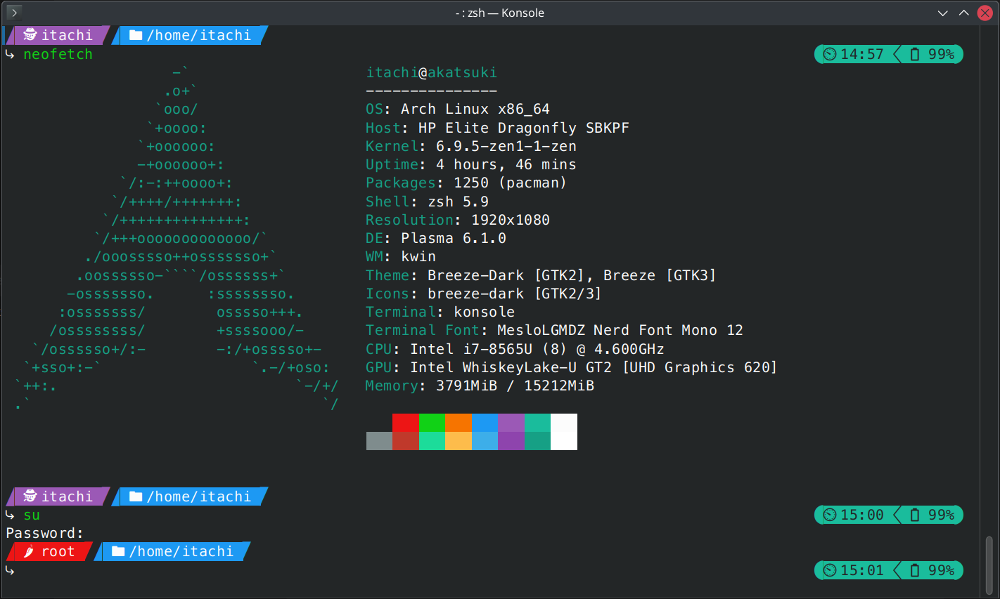
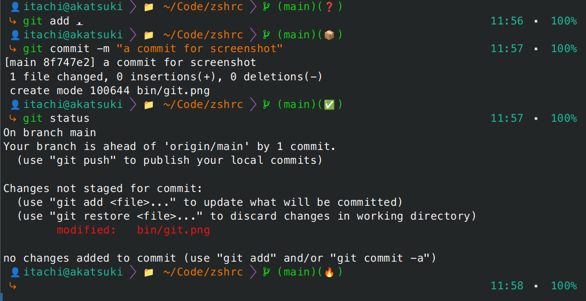

# zshrc themes

Three versions of `.zshrc` light and self-contained theme that do not need heavy stuff like *ohmyzsh*, with the basic stuff for a fresh install.
- *Auto Completion, Syntax Highlighting* and *Autosuggestions* plugins are sourced but require installation, so either install them or remove the line if not needed.
- Pre-configured common **Key Bindings**
- Time and battery info shown in the right prompt
- Fully commented for easy customization

## zshrc.basic: 
Colorful with different prompts for the current user and the root user

## zshrc.git.full:
Git focused version that displays the git branch and status

## zshrc.git.basic:
A lighter version of *zshrc.git.full* that displays only the git branch
