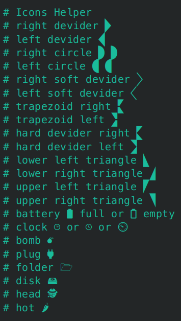

# zshrc minimal theme

A minimal `.zshrc` theme written to avoid heavy stuff like ohmyzsh. It is lightweight and self-contained, with the basic stuff for a fresh install and:

1. **Prompt**: Displays a different prompt for the current user and the root user
2. **Auto Completion, Syntax Highlighting, Autosuggestions:** Sourced but require installation of the respective plugins
3. **Key Bindings:** Pre-configured for convenience

Fully commented for easy customization, it needs the [Meslo font](./bin/meslo.tar.gz) to display the icons properly:
## Prompt

## Icons
Finding the "right" icon can be challenging. To help with this, some icon options have been added as comments at the end of the file. You can easily copy and replace/add them to your custom prompt.

