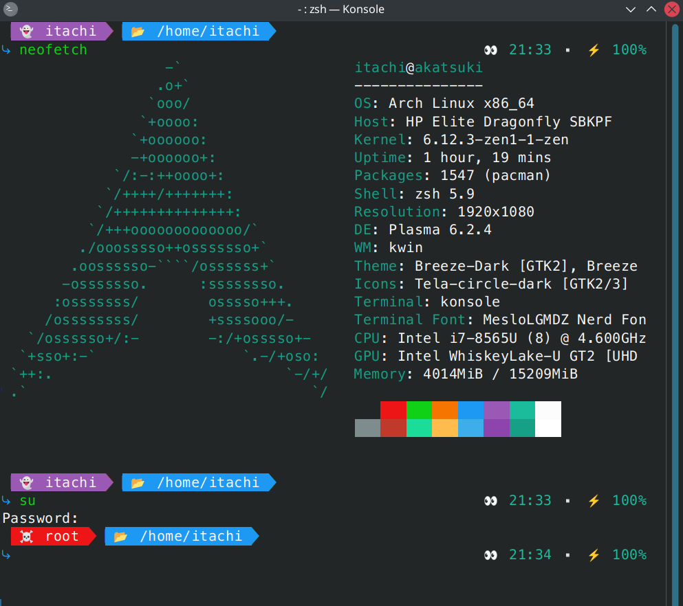

# zshrc themes

Three versions of `.zshrc` light and self-contained theme that do not need heavy stuff like ohmyzsh. They have the basic stuff for a fresh install:

## zshrc.basic: 
Colorful with different prompts for the current user and the root user

## zshrc.git.basic:
A lighter version that displays the git branch

## zshrc.git.full:
More elaborate version that displays the git branch and status

## Misc
1. **Auto Completion, Syntax Highlighting, Autosuggestions:** Sourced but require installation of the respective plugins
2. **Key Bindings:** Pre-configured for convenience
3. Fully commented for easy customization
4. Time and battery info in the right prompt
